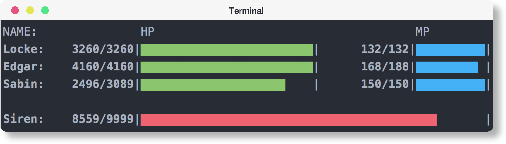
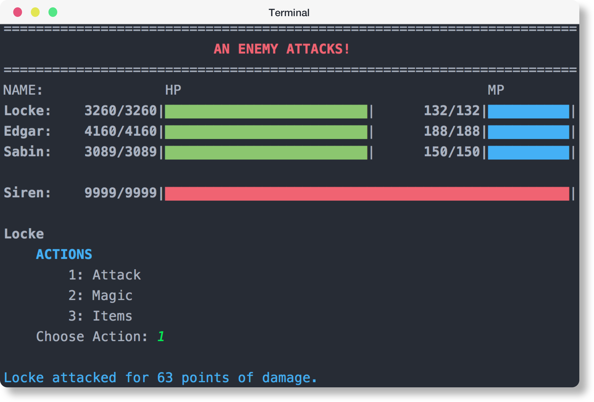
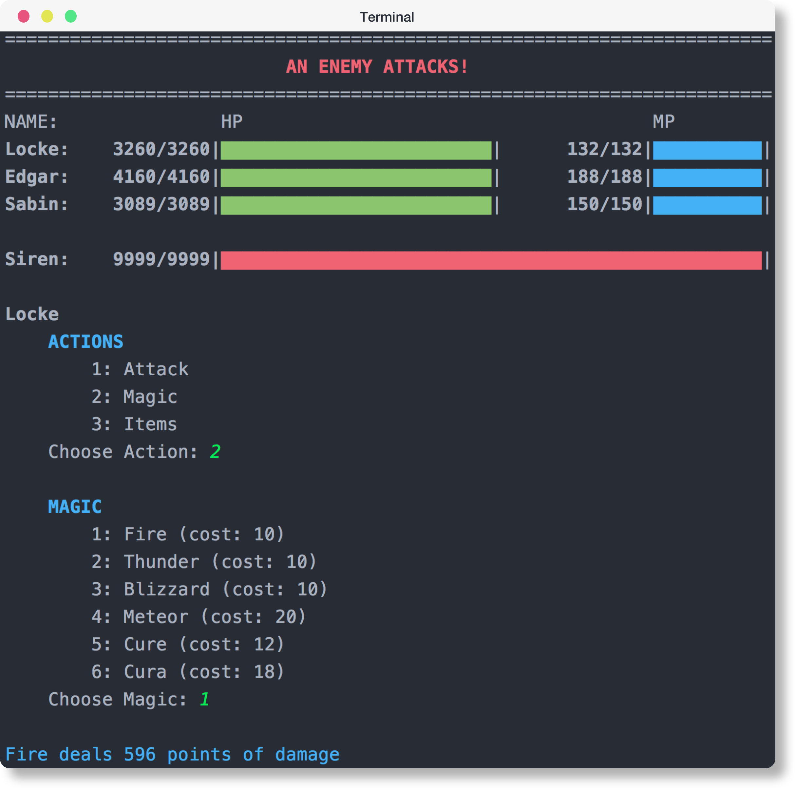
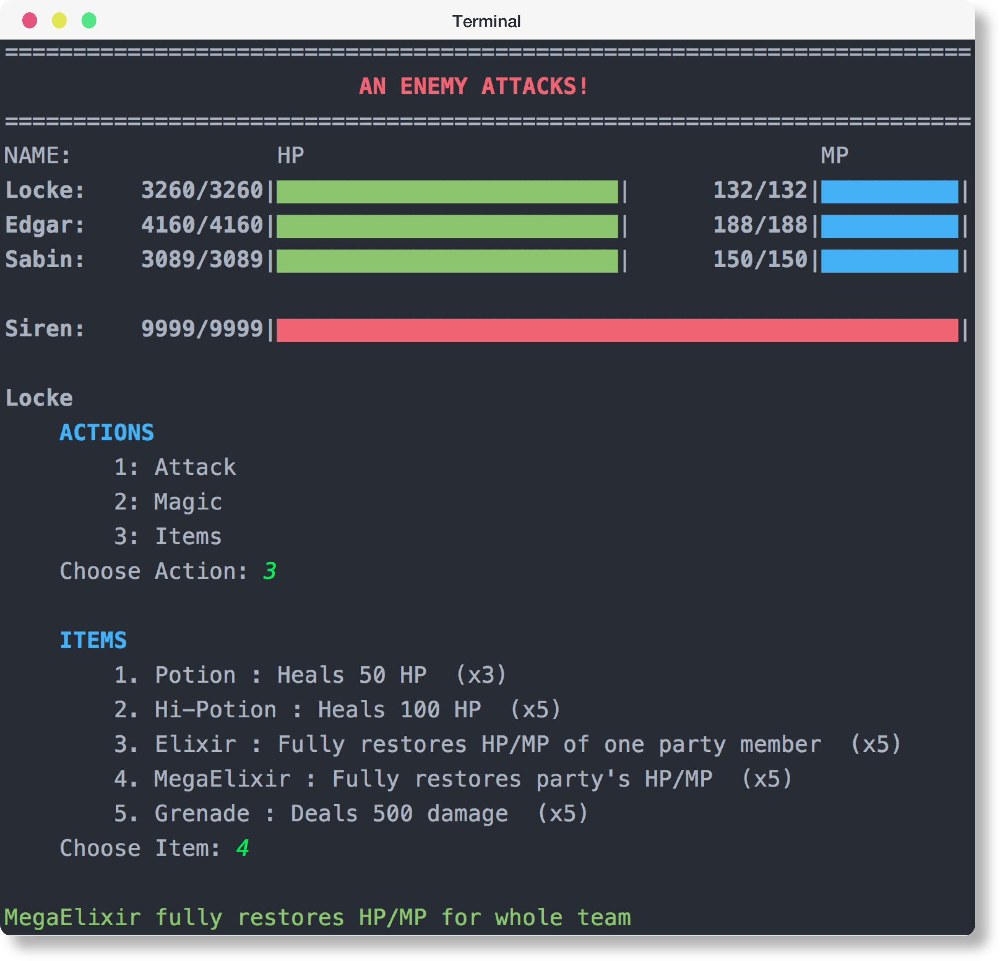

# Python - Final Fantasy RPG

In an attempt to get familiar with Python, I created an RPG. The game begins with three predefined players and one enemy

<p align="center">
  
</p>

The HP and MP bars update!

<p align="center">
  
</p>

### Run
```
git clone https://github.com/stefanzier/final-fantasy-rpg.git
cd final-fantasy-rpg
python main.py
```

### Actions
1. ***Attack*** - Each Person has a range of attack damage they can deal to the enemy. Randomly choose a number in this range
2. ***Magic***  - A list of spells. User can choose from the list and determine what spell they'd like to cast
3. ***Items***  - A list of items. Items include potions, elixirs and grenades

#### User Menu - Attack
<p align="center">
  
</p>

#### User Menu - Magic
<p align="center">
  
</p>

#### User Menu - Items
<p align="center">
  
</p>


